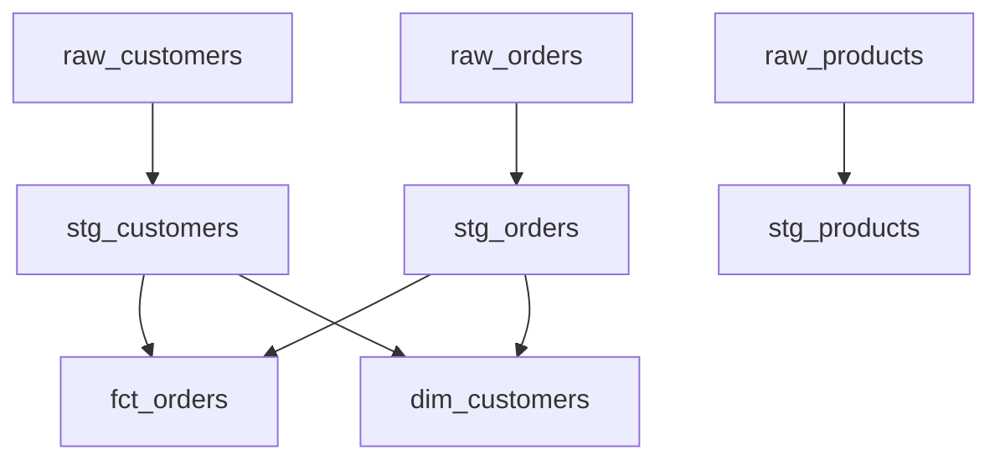
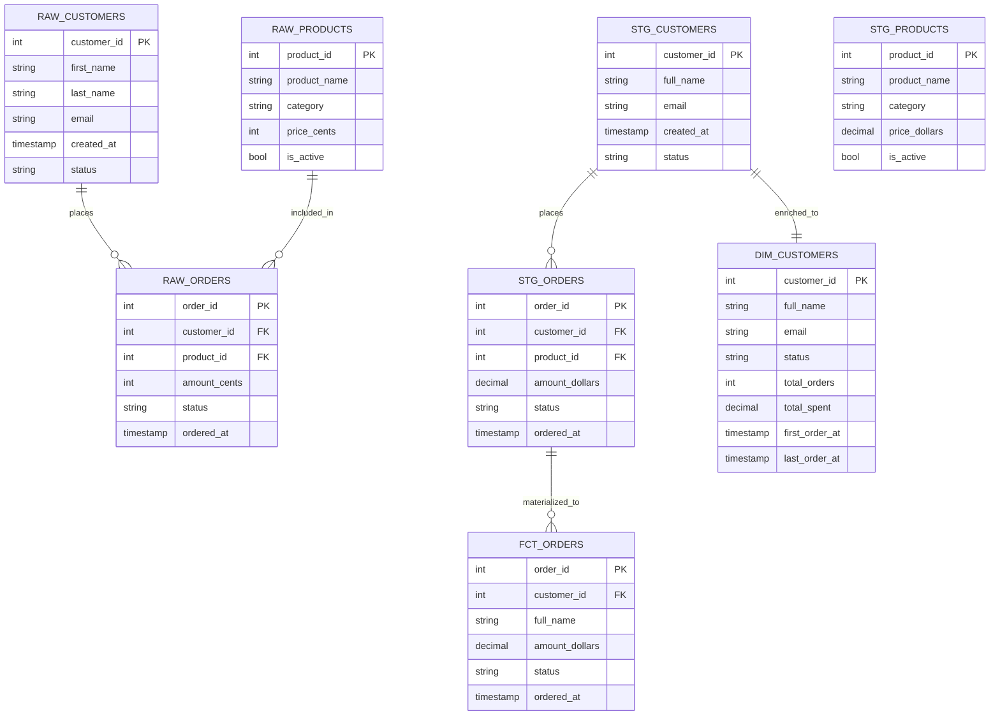

# Design Document: DBT Practice Project

## Overview

DBT Practice Project là một project DBT học tập hoàn chỉnh dành cho Data Engineer, kết nối với PostgreSQL. Project minh họa toàn bộ vòng đời của một DBT pipeline: từ raw data (seeds) → staging layer → mart layer, kèm theo macros tái sử dụng, tests chất lượng dữ liệu, documentation, và artifacts sinh ra sau mỗi lần chạy.

### Mục tiêu học tập

- Hiểu cấu trúc thư mục và file cấu hình của một DBT project chuẩn
- Nắm vững cách tổ chức model theo layers (staging → mart)
- Thực hành viết macros Jinja2 tái sử dụng
- Áp dụng generic tests và singular tests để kiểm tra chất lượng dữ liệu
- Đọc và phân tích artifacts (`manifest.json`, `run_results.json`) sau mỗi lần chạy

### Domain dữ liệu mẫu

Project sử dụng domain **E-commerce** với ba bảng raw data:
- `raw_customers` — thông tin khách hàng
- `raw_orders` — đơn hàng
- `raw_products` — sản phẩm

Domain này đủ đơn giản để học nhưng đủ phức tạp để minh họa JOIN, aggregation, và referential integrity.

---

## Architecture

### Luồng dữ liệu tổng thể

```mermaid
flowchart LR
    subgraph Seeds["Seeds (CSV)"]
        S1[raw_customers.csv]
        S2[raw_orders.csv]
        S3[raw_products.csv]
    end

    subgraph PostgreSQL_Raw["PostgreSQL - Raw Schema"]
        T1[raw_customers]
        T2[raw_orders]
        T3[raw_products]
    end

    subgraph Staging["models/staging/ (VIEW)"]
        ST1[stg_customers]
        ST2[stg_orders]
        ST3[stg_products]
    end

    subgraph Marts["models/marts/ (TABLE)"]
        M1[fct_orders]
        M2[dim_customers]
    end

    subgraph Artifacts["target/"]
        A1[manifest.json]
        A2[run_results.json]
        A3[catalog.json]
        A4[compiled/]
    end

    S1 -->|dbt seed| T1
    S2 -->|dbt seed| T2
    S3 -->|dbt seed| T3

    T1 -->|source()| ST1
    T2 -->|source()| ST2
    T3 -->|source()| ST3

    ST1 -->|ref()| M1
    ST2 -->|ref()| M1
    ST1 -->|ref()| M2
    ST2 -->|ref()| M2

    M1 & M2 -->|dbt run| Artifacts
```

### DAG (Directed Acyclic Graph)



### Môi trường thực thi

| Môi trường | Target name | Schema | Ghi chú |
|---|---|---|---|
| Development | `dev` | `dbt_dev` | Giới hạn dữ liệu qua macro |
| Production | `prod` | `analytics` | Toàn bộ dữ liệu |

---

## Components and Interfaces

### 1. Cấu hình Project (`dbt_project.yml`)

File cấu hình trung tâm của project, định nghĩa:
- Tên project và profile kết nối
- Đường dẫn đến các thư mục (models, seeds, macros, tests)
- Materialization mặc định theo layer

```yaml
name: 'dbt_practice_project'
version: '1.0.0'
config-version: 2
profile: 'dbt_practice_project'

model-paths: ["models"]
seed-paths: ["seeds"]
macro-paths: ["macros"]
test-paths: ["tests"]
analysis-paths: ["analyses"]
docs-paths: ["docs"]

target-path: "target"
clean-targets: ["target", "dbt_packages"]

models:
  dbt_practice_project:
    staging:
      +materialized: view
      +schema: staging
    marts:
      +materialized: table
      +schema: marts
```

### 2. Kết nối Database (`profiles.yml`)

File `profiles.yml` nằm tại `~/.dbt/profiles.yml` (ngoài project để tránh commit credentials):

```yaml
dbt_practice_project:
  target: dev
  outputs:
    dev:
      type: postgres
      host: "{{ env_var('DBT_HOST', 'localhost') }}"
      port: 5432
      user: "{{ env_var('DBT_USER', 'postgres') }}"
      password: "{{ env_var('DBT_PASSWORD') }}"
      dbname: "{{ env_var('DBT_DBNAME', 'dbt_practice') }}"
      schema: dbt_dev
      threads: 4
    prod:
      type: postgres
      host: "{{ env_var('DBT_HOST') }}"
      port: 5432
      user: "{{ env_var('DBT_USER') }}"
      password: "{{ env_var('DBT_PASSWORD') }}"
      dbname: "{{ env_var('DBT_DBNAME') }}"
      schema: analytics
      threads: 8
```

Sử dụng `env_var()` để tránh hard-code credentials, hỗ trợ cả dev và prod target.

### 3. Seeds

Ba file CSV trong `seeds/`:

**`seeds/raw_customers.csv`**
```
customer_id,first_name,last_name,email,created_at,status
1,Nguyen,Van A,nguyenvana@email.com,2024-01-01,active
...
```

**`seeds/raw_orders.csv`**
```
order_id,customer_id,product_id,amount_cents,status,ordered_at
1,1,2,15000,completed,2024-01-05
...
```

**`seeds/raw_products.csv`**
```
product_id,product_name,category,price_cents,is_active
1,Laptop,electronics,150000,true
...
```

File `seeds/schema.yml` khai báo column types và descriptions cho từng seed.

### 4. Sources

Khai báo trong `models/staging/schema.yml`:

```yaml
sources:
  - name: raw
    schema: dbt_dev
    description: "Raw data loaded từ seeds"
    tables:
      - name: raw_customers
        description: "Bảng khách hàng raw"
        loaded_at_field: created_at
        freshness:
          warn_after: {count: 7, period: day}
          error_after: {count: 30, period: day}
        columns:
          - name: customer_id
            description: "Primary key"
            tests:
              - not_null
              - unique
      - name: raw_orders
        ...
      - name: raw_products
        ...
```

### 5. Staging Models

Ba model trong `models/staging/`:

| Model | Source | Materialization | Transformations |
|---|---|---|---|
| `stg_customers.sql` | `raw_customers` | view | Rename columns, cast types, filter nulls |
| `stg_orders.sql` | `raw_orders` | view | Rename columns, cast amount_cents, filter invalid status |
| `stg_products.sql` | `raw_products` | view | Rename columns, cast price_cents, filter inactive |

Ví dụ `stg_orders.sql`:
```sql
with source as (
    select * from {{ source('raw', 'raw_orders') }}
),
renamed as (
    select
        order_id,
        customer_id,
        product_id,
        {{ cents_to_dollars('amount_cents') }} as amount_dollars,
        status,
        ordered_at::timestamp as ordered_at
    from source
    where order_id is not null
      and status in ('pending', 'completed', 'cancelled')
)
select * from renamed
```

### 6. Mart Models

Hai model trong `models/marts/`:

**`fct_orders.sql`** — Fact table tổng hợp đơn hàng:
```sql
with orders as (
    select * from {{ ref('stg_orders') }}
),
customers as (
    select * from {{ ref('stg_customers') }}
),
final as (
    select
        o.order_id,
        o.customer_id,
        c.full_name,
        o.amount_dollars,
        o.status,
        o.ordered_at
    from orders o
    left join customers c using (customer_id)
)
select * from final
```

**`dim_customers.sql`** — Dimension table với aggregated metrics:
```sql
with customers as (
    select * from {{ ref('stg_customers') }}
),
orders as (
    select * from {{ ref('stg_orders') }}
),
customer_orders as (
    select
        customer_id,
        count(order_id) as total_orders,
        sum(amount_dollars) as total_spent,
        min(ordered_at) as first_order_at,
        max(ordered_at) as last_order_at
    from orders
    group by customer_id
),
final as (
    select
        c.*,
        coalesce(co.total_orders, 0) as total_orders,
        coalesce(co.total_spent, 0) as total_spent,
        co.first_order_at,
        co.last_order_at
    from customers c
    left join customer_orders co using (customer_id)
)
select * from final
```

### 7. Macros

Ba macro trong `macros/`:

**`macros/cents_to_dollars.sql`**
```sql

    round({{ column_name }} / 100.0, {{ precision }})

```

**`macros/generate_schema_name.sql`** — Override schema naming:
```sql

    
    
        {{ default_schema }}
    
        {{ custom_schema_name | trim }}
    

```

**`macros/limit_data_in_dev.sql`**
```sql

    
        where {{ column_name }} >= current_date - interval '{{ dev_limit }} days'
    

```

### 8. Tests

**Generic tests** trong `schema.yml`:
- `not_null` + `unique` trên primary keys của tất cả models
- `accepted_values` trên cột `status` của `stg_orders` và `fct_orders`
- `relationships` giữa `stg_orders.customer_id` → `stg_customers.customer_id`

**Singular test** trong `tests/`:
- `tests/assert_positive_order_amounts.sql` — kiểm tra tất cả đơn hàng có `amount_dollars > 0`

### 9. Documentation

- `description` cho tất cả models trong `schema.yml`
- `description` cho primary key và foreign key columns
- `docs/` chứa docs blocks cho model phức tạp
- `docs/reading-artifacts.md` hướng dẫn đọc artifacts

---

## Data Models

### Entity Relationship Diagram



### Cấu trúc thư mục đầy đủ

```
dbt-practice-project/
├── dbt_project.yml
├── README.md
├── .gitignore
├── models/
│   ├── staging/
│   │   ├── schema.yml          ← sources + staging model docs + tests
│   │   ├── stg_customers.sql
│   │   ├── stg_orders.sql
│   │   └── stg_products.sql
│   └── marts/
│       ├── schema.yml          ← mart model docs + tests
│       ├── fct_orders.sql
│       └── dim_customers.sql
├── macros/
│   ├── cents_to_dollars.sql
│   ├── generate_schema_name.sql
│   ├── limit_data_in_dev.sql
│   └── properties.yml          ← macro documentation
├── seeds/
│   ├── schema.yml
│   ├── raw_customers.csv
│   ├── raw_orders.csv
│   └── raw_products.csv
├── tests/
│   └── assert_positive_order_amounts.sql
├── docs/
│   ├── reading-artifacts.md
│   └── overview.md             ← docs block cho model overview
└── target/                     ← sinh ra tự động (gitignored)
    ├── manifest.json
    ├── run_results.json
    ├── catalog.json
    └── compiled/
        └── dbt_practice_project/
            └── models/
```

### Artifact Schema

**`manifest.json`** (sinh ra bởi `dbt compile`, `dbt run`, `dbt test`):
```json
{
  "metadata": {
    "dbt_schema_version": "...",
    "dbt_version": "1.x.x",
    "generated_at": "2024-01-01T00:00:00Z",
    "invocation_id": "uuid"
  },
  "nodes": {
    "model.dbt_practice_project.stg_customers": {
      "unique_id": "model.dbt_practice_project.stg_customers",
      "name": "stg_customers",
      "resource_type": "model",
      "depends_on": { "nodes": ["source.dbt_practice_project.raw.raw_customers"] },
      "compiled_code": "select ...",
      "config": { "materialized": "view" }
    }
  },
  "sources": { ... },
  "exposures": {}
}
```

**`run_results.json`** (sinh ra bởi `dbt run`, `dbt test`, `dbt seed`):
```json
{
  "metadata": { ... },
  "results": [
    {
      "unique_id": "model.dbt_practice_project.stg_customers",
      "status": "success",
      "execution_time": 0.45,
      "adapter_response": { "rows_affected": 0 },
      "message": "CREATE VIEW"
    }
  ],
  "elapsed_time": 2.3
}
```

`status` có thể là: `success`, `error`, `skipped`, `warn`, `pass`, `fail`.

---
## Correctness Properties

*A property is a characteristic or behavior that should hold true across all valid executions of a system — essentially, a formal statement about what the system should do. Properties serve as the bridge between human-readable specifications and machine-verifiable correctness guarantees.*

Các properties dưới đây được rút ra từ acceptance criteria có thể kiểm tra tự động. Project này chủ yếu là cấu hình và SQL transformation, nên phần lớn properties tập trung vào: (1) code patterns (source/ref usage), (2) macro correctness, (3) data quality rules, và (4) artifact structure.

### Property 1: Staging models chỉ tham chiếu raw data qua `source()`

*For any* staging model file trong `models/staging/`, SQL compiled của model đó SHALL không chứa hard-coded schema name hoặc table name — tất cả tham chiếu đến raw tables phải thông qua hàm `{{ source() }}`.

**Validates: Requirements 3.2, 4.5**

---

### Property 2: Mart models chỉ tham chiếu models khác qua `ref()`

*For any* mart model file trong `models/marts/`, SQL compiled của model đó SHALL không chứa hard-coded schema name hoặc table name — tất cả tham chiếu đến models khác phải thông qua hàm `{{ ref() }}`.

**Validates: Requirements 5.2**

---

### Property 3: Mart models thực hiện aggregation hoặc JOIN

*For any* mart model file trong `models/marts/`, SQL source của model đó SHALL chứa ít nhất một trong các từ khóa: `GROUP BY`, `JOIN`, `SUM(`, `COUNT(`, `AVG(`, `MIN(`, `MAX(`.

**Validates: Requirements 5.3**

---

### Property 4: Macro `cents_to_dollars` tính toán đúng

*For any* số nguyên không âm `cents`, hàm `cents_to_dollars(cents)` SHALL trả về giá trị bằng `round(cents / 100.0, 2)`. Đặc biệt: `cents_to_dollars(0) = 0.00`, `cents_to_dollars(100) = 1.00`, `cents_to_dollars(150) = 1.50`.

**Validates: Requirements 6.2**

---

### Property 5: Macro `generate_schema_name` trả về đúng schema

*For any* giá trị `custom_schema_name`: nếu `custom_schema_name` là `None` thì macro SHALL trả về `target.schema`; nếu `custom_schema_name` có giá trị thì macro SHALL trả về `custom_schema_name` (trimmed), không phụ thuộc vào `target.schema`.

**Validates: Requirements 6.3**

---

### Property 6: Macro `limit_data_in_dev` chỉ sinh WHERE clause trong môi trường dev

*For any* column name và dev_limit: khi `target.name == 'dev'`, macro SHALL sinh ra chuỗi chứa `WHERE`; khi `target.name != 'dev'` (ví dụ `prod`), macro SHALL sinh ra chuỗi rỗng (không có WHERE clause).

**Validates: Requirements 6.4**

---

### Property 7: Cột `status` trong orders chỉ nhận accepted values

*For any* row trong bảng `stg_orders` hoặc `fct_orders`, giá trị cột `status` SHALL là một trong: `'pending'`, `'completed'`, `'cancelled'`. Không có row nào được có status ngoài tập này.

**Validates: Requirements 7.2**

---

### Property 8: Referential integrity giữa orders và customers

*For any* row trong bảng `stg_orders`, giá trị `customer_id` SHALL tồn tại trong bảng `stg_customers`. Không có orphaned order nào được tồn tại trong data.

**Validates: Requirements 7.3**

---

### Property 9: Tất cả đơn hàng có giá trị dương

*For any* row trong bảng `fct_orders` hoặc `stg_orders`, giá trị `amount_dollars` SHALL lớn hơn 0. Không có đơn hàng nào được có giá trị âm hoặc bằng 0.

**Validates: Requirements 7.4**

---

### Property 10: `manifest.json` có đầy đủ required fields

*For any* lần chạy lệnh DBT (`dbt run`, `dbt compile`, `dbt test`), file `target/manifest.json` sinh ra SHALL chứa tất cả các top-level keys: `metadata`, `nodes`, `sources`, `exposures`. Mỗi node trong `nodes` SHALL có các fields: `unique_id`, `name`, `resource_type`, `depends_on`, `config`.

**Validates: Requirements 8.3**

---

### Property 11: `run_results.json` chỉ chứa status hợp lệ

*For any* result trong mảng `results` của `target/run_results.json`, trường `status` SHALL là một trong: `'success'`, `'error'`, `'skipped'`, `'warn'`, `'pass'`, `'fail'`. Không có status nào ngoài tập này.

**Validates: Requirements 8.4**

---

### Property 12: Documentation coverage cho models

*For any* tập hợp models trong project, tỷ lệ models có trường `description` không rỗng trong `schema.yml` SHALL lớn hơn hoặc bằng 80%. Đây là invariant về documentation completeness.

**Validates: Requirements 9.1**

---

### Property 13: PK/FK columns có description

*For any* column được khai báo với test `not_null` + `unique` (primary key) hoặc test `relationships` (foreign key) trong `schema.yml`, column đó SHALL có trường `description` không rỗng.

**Validates: Requirements 9.2**

---

### Property 14: Materialization config đúng theo layer

*For any* staging model, config `materialized` SHALL là `'view'`. *For any* mart model, config `materialized` SHALL là `'table'`. Property này được enforce qua `dbt_project.yml` và có thể verify qua `manifest.json` sau khi compile.

**Validates: Requirements 4.2, 10.2**

---

## Error Handling

### Lỗi kết nối database

| Tình huống | Hành vi mong đợi |
|---|---|
| Host không tồn tại | `dbt debug` báo `Connection refused` với tên host |
| Sai credentials | `dbt debug` báo `authentication failed` với username |
| Database không tồn tại | `dbt debug` báo `database does not exist` |
| Port sai | `dbt debug` báo `Connection refused` với port number |

DBT CLI tự xử lý và hiển thị lỗi kết nối — project không cần code xử lý riêng, chỉ cần đảm bảo `profiles.yml` có cấu hình đúng.

### Lỗi compile Jinja2

| Tình huống | Hành vi mong đợi |
|---|---|
| Macro không tồn tại | `dbt compile` báo `Macro not found: macro_name` |
| Sai số tham số macro | `dbt compile` báo lỗi với tên macro và tham số thiếu |
| Ref đến model không tồn tại | `dbt compile` báo `Model not found: model_name` |
| Source không được khai báo | `dbt compile` báo `Source not found: source_name.table_name` |

### Lỗi dữ liệu (Test failures)

| Tình huống | Hành vi mong đợi |
|---|---|
| `not_null` test fail | `dbt test` báo số rows vi phạm, exit code != 0 |
| `unique` test fail | `dbt test` báo số duplicate values, exit code != 0 |
| `accepted_values` fail | `dbt test` báo các giá trị không hợp lệ |
| `relationships` fail | `dbt test` báo số orphaned records |
| Singular test fail | `dbt test` báo số rows trả về từ test query |

### Lỗi seed

| Tình huống | Hành vi mong đợi |
|---|---|
| CSV thiếu header | `dbt seed` báo lỗi parse và dừng |
| Sai delimiter | `dbt seed` báo lỗi format |
| Type mismatch | `dbt seed` báo lỗi khi insert vào database |

### Chiến lược xử lý lỗi trong macros

- Macros không nên raise exception trừ khi tham số thực sự invalid
- `generate_schema_name` phải handle `None` input gracefully (trả về default schema)
- `limit_data_in_dev` phải handle mọi giá trị `target.name` (chỉ filter khi `== 'dev'`)
- `cents_to_dollars` phải handle `NULL` input (trả về `NULL`, không crash)

---

## Testing Strategy

### Tổng quan

Project này kết hợp hai loại test:
1. **DBT native tests** — generic tests và singular tests chạy qua `dbt test`
2. **Unit tests cho macros** — kiểm tra logic Jinja2 macro độc lập với database

### DBT Native Tests

#### Generic Tests (khai báo trong `schema.yml`)

```yaml
# Ví dụ trong models/staging/schema.yml
models:
  - name: stg_orders
    columns:
      - name: order_id
        tests:
          - not_null
          - unique
      - name: status
        tests:
          - accepted_values:
              values: ['pending', 'completed', 'cancelled']
      - name: customer_id
        tests:
          - relationships:
              to: ref('stg_customers')
              field: customer_id
      - name: amount_dollars
        tests:
          - not_null
```

#### Singular Tests (file SQL trong `tests/`)

```sql
-- tests/assert_positive_order_amounts.sql
-- Validates: Property 9 (Requirements 7.4)
-- Feature: dbt-practice-project, Property 9: all orders have positive amount
select
    order_id,
    amount_dollars
from {{ ref('fct_orders') }}
where amount_dollars <= 0
```

Test này fail nếu trả về bất kỳ row nào (DBT convention: test fail = query trả về rows).

### Unit Tests cho Macros (Property-Based Testing)

Sử dụng **pytest** với **dbt-unit-testing** hoặc test thuần Python để kiểm tra macro logic.

**Thư viện PBT**: [Hypothesis](https://hypothesis.readthedocs.io/) (Python)

**Cấu hình**: Minimum 100 iterations per property test.

#### Property 4: `cents_to_dollars` macro

```python
# tests/unit/test_macros.py
from hypothesis import given, settings
import hypothesis.strategies as st

@given(cents=st.integers(min_value=0, max_value=10_000_000))
@settings(max_examples=100)
def test_cents_to_dollars_property(cents):
    """
    Feature: dbt-practice-project, Property 4: cents_to_dollars correctness
    For any non-negative integer cents, result = round(cents / 100.0, 2)
    """
    result = cents_to_dollars(cents)
    expected = round(cents / 100.0, 2)
    assert result == expected
```

#### Property 5: `generate_schema_name` macro

```python
@given(
    custom_schema=st.one_of(st.none(), st.text(min_size=1, max_size=50)),
    target_schema=st.text(min_size=1, max_size=50)
)
@settings(max_examples=100)
def test_generate_schema_name_property(custom_schema, target_schema):
    """
    Feature: dbt-practice-project, Property 5: generate_schema_name logic
    If custom_schema is None -> return target_schema
    If custom_schema has value -> return custom_schema (trimmed)
    """
    result = generate_schema_name(custom_schema, target_schema)
    if custom_schema is None:
        assert result == target_schema
    else:
        assert result == custom_schema.strip()
```

#### Property 6: `limit_data_in_dev` macro

```python
@given(
    column_name=st.text(min_size=1, max_size=50),
    dev_limit=st.integers(min_value=1, max_value=365),
    target_name=st.sampled_from(['dev', 'prod', 'staging', 'ci'])
)
@settings(max_examples=100)
def test_limit_data_in_dev_property(column_name, dev_limit, target_name):
    """
    Feature: dbt-practice-project, Property 6: limit_data_in_dev target-aware
    When target = dev -> output contains WHERE
    When target != dev -> output is empty
    """
    result = limit_data_in_dev(column_name, dev_limit, target_name)
    if target_name == 'dev':
        assert 'WHERE' in result.upper()
    else:
        assert result.strip() == ''
```

### DBT Tests cho Data Quality Properties

#### Property 7: `accepted_values` cho status

Được implement bằng generic test `accepted_values` trong `schema.yml` — DBT tự sinh SQL kiểm tra.

#### Property 8: Referential integrity

Được implement bằng generic test `relationships` trong `schema.yml`.

#### Property 9: Positive order amounts

Được implement bằng singular test `tests/assert_positive_order_amounts.sql`.

### Tests cho Artifact Structure (Properties 10, 11)

```python
# tests/unit/test_artifacts.py
import json
from hypothesis import given, settings
import hypothesis.strategies as st

def test_manifest_required_fields():
    """
    Feature: dbt-practice-project, Property 10: manifest.json structure
    """
    with open('target/manifest.json') as f:
        manifest = json.load(f)
    
    assert 'metadata' in manifest
    assert 'nodes' in manifest
    assert 'sources' in manifest
    assert 'exposures' in manifest
    
    for node_id, node in manifest['nodes'].items():
        assert 'unique_id' in node
        assert 'name' in node
        assert 'resource_type' in node
        assert 'depends_on' in node
        assert 'config' in node

VALID_STATUSES = {'success', 'error', 'skipped', 'warn', 'pass', 'fail'}

def test_run_results_valid_statuses():
    """
    Feature: dbt-practice-project, Property 11: run_results.json status values
    """
    with open('target/run_results.json') as f:
        run_results = json.load(f)
    
    for result in run_results['results']:
        assert result['status'] in VALID_STATUSES
```

### Tests cho Documentation Coverage (Properties 12, 13)

```python
# tests/unit/test_documentation.py
import yaml
import glob

def test_model_description_coverage():
    """
    Feature: dbt-practice-project, Property 12: 80% model description coverage
    """
    schema_files = glob.glob('models/**/*.yml', recursive=True)
    total_models = 0
    documented_models = 0
    
    for schema_file in schema_files:
        with open(schema_file) as f:
            schema = yaml.safe_load(f)
        for model in schema.get('models', []):
            total_models += 1
            if model.get('description', '').strip():
                documented_models += 1
    
    coverage = documented_models / total_models if total_models > 0 else 0
    assert coverage >= 0.8, f"Documentation coverage {coverage:.0%} < 80%"

def test_pk_fk_columns_have_descriptions():
    """
    Feature: dbt-practice-project, Property 13: PK/FK columns have descriptions
    """
    schema_files = glob.glob('models/**/*.yml', recursive=True)
    
    for schema_file in schema_files:
        with open(schema_file) as f:
            schema = yaml.safe_load(f)
        for model in schema.get('models', []):
            for col in model.get('columns', []):
                tests = [t if isinstance(t, str) else list(t.keys())[0]
                         for t in col.get('tests', [])]
                is_pk = 'not_null' in tests and 'unique' in tests
                is_fk = 'relationships' in tests
                if is_pk or is_fk:
                    assert col.get('description', '').strip(), \
                        f"Column {col['name']} in {model['name']} is PK/FK but has no description"
```

### Tests cho Code Patterns (Properties 1, 2, 3, 14)

```python
# tests/unit/test_code_patterns.py
import glob
import re
import yaml

def test_staging_models_use_source():
    """
    Feature: dbt-practice-project, Property 1: staging models use source()
    """
    staging_files = glob.glob('models/staging/*.sql')
    for sql_file in staging_files:
        with open(sql_file) as f:
            content = f.read()
        assert '{{ source(' in content, \
            f"{sql_file} does not use source() macro"
        # Không được hard-code schema name
        assert 'dbt_dev.' not in content
        assert 'public.' not in content

def test_mart_models_use_ref():
    """
    Feature: dbt-practice-project, Property 2: mart models use ref()
    """
    mart_files = glob.glob('models/marts/*.sql')
    for sql_file in mart_files:
        with open(sql_file) as f:
            content = f.read()
        assert '{{ ref(' in content, \
            f"{sql_file} does not use ref() macro"

def test_mart_models_have_aggregation_or_join():
    """
    Feature: dbt-practice-project, Property 3: mart models have aggregation/JOIN
    """
    mart_files = glob.glob('models/marts/*.sql')
    aggregation_keywords = ['GROUP BY', 'JOIN', 'SUM(', 'COUNT(', 'AVG(', 'MIN(', 'MAX(']
    for sql_file in mart_files:
        with open(sql_file) as f:
            content = f.read().upper()
        has_aggregation = any(kw in content for kw in aggregation_keywords)
        assert has_aggregation, \
            f"{sql_file} does not contain aggregation or JOIN"

def test_materialization_config():
    """
    Feature: dbt-practice-project, Property 14: materialization config per layer
    """
    with open('dbt_project.yml') as f:
        config = yaml.safe_load(f)
    
    models_config = config.get('models', {}).get('dbt_practice_project', {})
    assert models_config.get('staging', {}).get('+materialized') == 'view'
    assert models_config.get('marts', {}).get('+materialized') == 'table'
```

### Tóm tắt Test Coverage

| Property | Test Type | File | Thư viện |
|---|---|---|---|
| P1: Staging dùng source() | Unit (code pattern) | `tests/unit/test_code_patterns.py` | pytest |
| P2: Mart dùng ref() | Unit (code pattern) | `tests/unit/test_code_patterns.py` | pytest |
| P3: Mart có aggregation/JOIN | Unit (code pattern) | `tests/unit/test_code_patterns.py` | pytest |
| P4: cents_to_dollars | Property-based | `tests/unit/test_macros.py` | Hypothesis |
| P5: generate_schema_name | Property-based | `tests/unit/test_macros.py` | Hypothesis |
| P6: limit_data_in_dev | Property-based | `tests/unit/test_macros.py` | Hypothesis |
| P7: accepted_values status | DBT generic test | `models/staging/schema.yml` | dbt test |
| P8: Referential integrity | DBT generic test | `models/staging/schema.yml` | dbt test |
| P9: Positive amounts | DBT singular test | `tests/assert_positive_order_amounts.sql` | dbt test |
| P10: manifest.json structure | Unit (artifact) | `tests/unit/test_artifacts.py` | pytest |
| P11: run_results.json status | Unit (artifact) | `tests/unit/test_artifacts.py` | pytest |
| P12: 80% doc coverage | Unit (documentation) | `tests/unit/test_documentation.py` | pytest |
| P13: PK/FK descriptions | Unit (documentation) | `tests/unit/test_documentation.py` | pytest |
| P14: Materialization config | Unit (config) | `tests/unit/test_code_patterns.py` | pytest |

### Lệnh chạy tests

```bash
# Chạy tất cả DBT tests (generic + singular)
dbt test

# Chạy unit tests (macros, artifacts, documentation, code patterns)
pytest tests/unit/ -v

# Chạy property-based tests với nhiều iterations hơn
pytest tests/unit/test_macros.py -v --hypothesis-seed=0

# Chạy toàn bộ pipeline
dbt seed && dbt run && dbt test && pytest tests/unit/ -v
```
